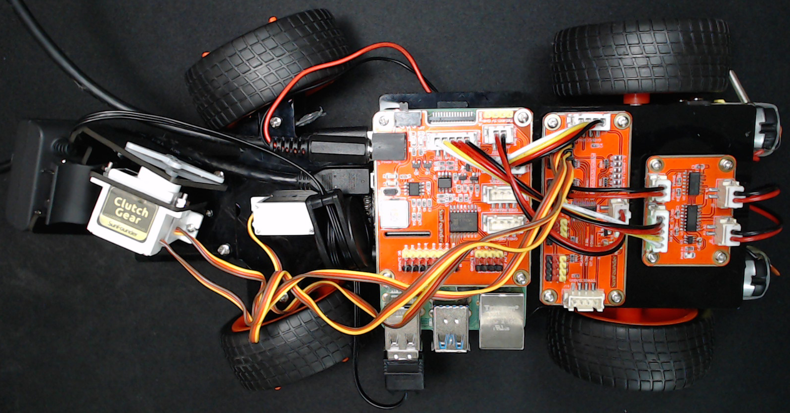
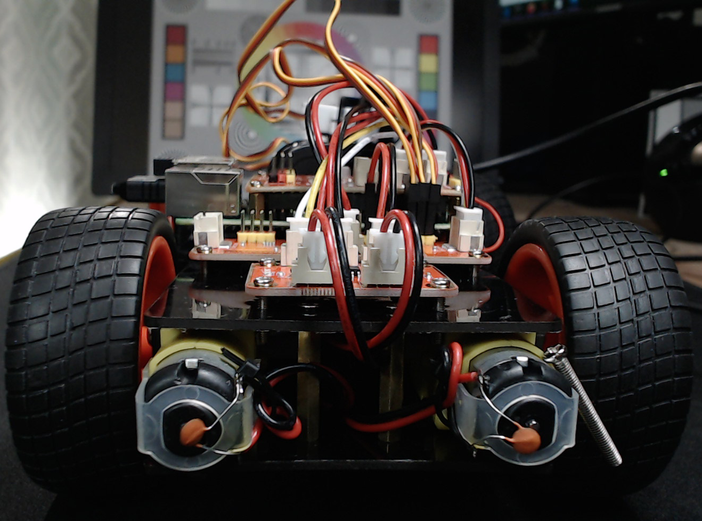

# SmartCar1

SmartCar1 is a DIY self-driving car kit from SunFounder, the Smart Video Car Kit V2.0 for Raspberry Pi. The car consists of two electric motors for driving forwards and backwards and a servo to turn the front wheels left and right.

